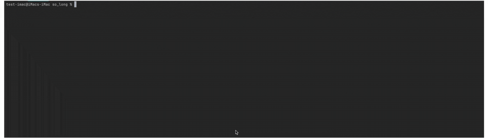

<h1>
[](https://github.com/JaeSeoKim/badge42)
</h1>

# So_long - Final Score [](https://github.com/JaeSeoKim/badge42)

<h1 align="center">✋ BEWARE ✋</h1>

## If you are a 42 Student, do not copy/paste this project, it will be considered cheating and you will be grated -42.



# 42 Wolfsburg Cursus 
## So Long
## And thanks for all the fish!

# Summary

## This project is a very small 2D game. <br>Its purpose is to make you work with textures, sprites, <br>and some other very basic gameplay elements.

# Contents

1. [Introduction](#intro)
2. [Objectives](#objectives)
3. [Mandatory Part](#manda)
4. [Bonus Part](#bonus)
5. [Example](#example)

# <a name="intro">Introduction</a>

| Introduction |  |
| ----- | ----- |
| | Being a developer is a great thing for creating your own game.<br>But a good game needs some good assets. In order to create 2D games, you will have <br>to search for tiles, tilesets, sprites, and sprite sheets.<br>Fortunately, some talented artists are willing to share their works on platforms like: <br>[itch.io](https://itch.io/game-assets/free/tag-sprites)<br>In any case, try to respect other people’s work. |

<p align="right">
 <a href="https://github.com/Cerberus2290/so_long#-beware-">back to top</a>
</p>

# <a name="objectives">Objectives</a>

| Objectives |  |
| ----- | ----- |
| | It’s time for you to create a basic computer graphics project! |
| | **so long** will help you improve your skills in the following areas: window management,<br>event handling, colors, textures, and so forth. |
| | You are going to use the school graphical library: **the MiniLibX!**<br>This library was developed internally and includes basic necessary tools to open a window, create images and deal with keyboard and mouse events. |
| | The other goals are similar to every other goal for this first year: being rigorous, level<br>up in **C** programming, use basic algorithms, do some information research, and so forth. |

<p align="right">
 <a href="https://github.com/Cerberus2290/so_long#-beware-">back to top</a>
</p>

# <a name="manda">Mandatory Part</a>

## III.1 - The "so_long" program

| Mandatory part |  |
| ----- | ----- |
| **Program name** | so_long |
| **Turn in files** | Makefile, *.h, *.c, maps, textures |
| **Makefile** | NAME, all, clean, fclean, re |
| **Arguments** | A map in format *.ber |
| **External functs.** | * open, close, read, write, malloc, free, perror, strerror, exit <br> * All functions of the math library (-lm compiler option, man man 3 math) <br> * All functions of the MiniLibX <br> * ft_printf and any equivalent **YOU** coded |
| **Libft authorized** | Yes |
| Description | You must create a basic 2D game in which a dolphin escapes Earth after eating some fish. <br> Instead of a dolphin, fish, and the Earth, you can use any character, any collectible and any place you want. |

Your project must comply with the following rules:

* You **must** use the *MiniLibX*. Either the version available on the school machines, or installing it using its sources.
* You have to turn in a *Makefile* which will compile your source files. It must not relink.
* Your program has to take as parameter a map description file ending with the **.ber** extension.

## III.2 - Game

* The player’s goal is to collect every collectible present on the map, then escape chosing the shortest possible route.
* The **W**, **A**, **S**, and **D** keys must be used to move the main character.
* The player should be able to move in these **4 directions**: up, down, left, right.
* The player should *not* be able to move into walls.
* At every move, the current **number of movements** must be displayed in the shell.
* You have to use a **2D view** (top-down or profile).
* The game doesn’t have to be real time.
* You can create the world you want!

## :information_source: <br> If you prefer, you can use ZQSD or the arrow keys on your keyboard to move your main character.<br> :information_source:

## III.3 - Graphic Management

* Your program has to display the image in a window.
* The management of your window must remain smooth (changing to another window, minimizing, and so forth).
* Pressing **ESC** must close the window and quit the program in a clean way.
* Clicking on the cross on the window’s frame must close the window and quit the program in a clean way.
* The use of the *images* of the *MiniLibX* is mandatory.

## III.4 - Map

* The map has to be constructed with 3 components: walls, collectibles, and free space.
* The map can be composed of only these 5 characters:
    * **0** for an empty space,
    * **1** for a wall,
    * **C** for a collectible,
    * **E** for a map exit,
    * **P** for the player’s starting position.

Here is a simple valid map:

````
1111111111111
10010000000C1
1000011111001
1P0011E000001
1111111111111
````

* The map must contain the following tiles to be valid:
    * 1 *exit*, 
    * at least 1 *collectible*, 
    * 1 *starting position*

## :information_source: <br> If the map contains a duplicates characters (exit/start), you should display an error message.<br> :information_source:

* The map must be rectangular.
* The map must be closed/surrounded by walls. If it’s not, the program must return an error.
* You have to check if there’s a valid path in the map.
* You must be able to parse any kind of map, as long as it respects the above rules.

Another example of a minimal .ber map:

````
1111111111111111111111111111111111
1E0000000000000C00000C000000000001
1010010100100000101001000000010101
1010010010101010001001000000010101
1P0000000C00C0000000000000000000C1
1111111111111111111111111111111111
````

* If any misconfiguration of any kind is encountered in the file, the program must exit in a clean way, and return **"Error\n"** <br> followed by an explicit error message of your choice.

<p align="right">
 <a href="https://github.com/Cerberus2290/so_long#-beware-">back to top</a>
</p>

# <a name="bonus">Bonus Part</a>

Usually, you would be encouraged to develop your own original extra features. However, there will be much more interesting graphic projects later. They are waiting for you!! Don’t lose too much time on this assignment!

You are allowed to use other functions to complete the bonus part as long as their use is justified during your evaluation. Be smart!

You will get extra points if you:

* Make the player lose when they touch an enemy patrol.
* Add some sprite animation.
* Display the movement count directly on screen instead of writing it in the shell.

## :information_source: <br> You can add files/folders based on bonuses as needed.<br> :information_source:

## :heavy_exclamation_mark: <br> The bonus part will only be assessed if the mandatory part is PERFECT. Perfect means the mandatory part has been integrally done and works without malfunctioning. If you have not passed ALL the mandatory requirements, your bonus part will not be evaluated at all.<br> :heavy_exclamation_mark:

<p align="right">
 <a href="https://github.com/Cerberus2290/so_long#-beware-">back to top</a>
</p>